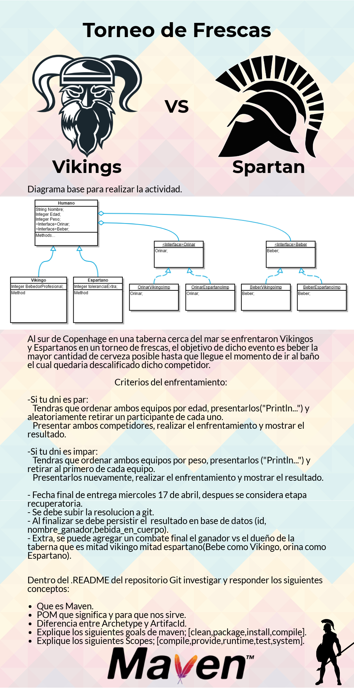

 

# Torneo De Ferscas
Primer TP Laboratorio 5 - Strategy Pattern

## Qué es Maven
Maven es una herramienta para la gestión de proyectos de software, es usada para construir proyectos, dependencias y documentación. Básicamente automatiza y simplifica el proceso de construcción, resuelve dependencias y provee información sobre el proyecto.

## Qué es POM y para qué nos sirve
POM (Project Object Model) son archivos XML que contienen información relacionada con el proyecto y la información de configuración, como las dependencias, directorio fuente, plugins, metas, etc. Usadas por Maven para construir un proyecto.
Al ejecutar Maven sobre un archivo POM este se encarga de cargar automáticamente las dependencias y configuraciones de un proyecto, sin necesidad de hacerlo manualmente.

## Diferencia entre Archetype y Artifacid

- **ArtifacId** es el identificador único del artefacto principal de un proyecto. El artefacto principal para un proyecto es típicamente el archivo JAR. Los artefactos secundarios como los paquetes de origen también usan el artefacto como parte de su nombre final.

- En cambio **Archetype** es una plantilla de proyecto, definida como un patrón o modelo original a partir del cual se hacen todas las otras cosas del mismo tipo. También son empaquetados en un archivo JAR, pero solo contienen las configuraciones y datos necesarios para generar la plantilla del proyecto.

## Goles de Maven:
La construcción de Maven sigue un ciclo de vida específico para implementar y distribuir el proyecto objetivo. Hay tres ciclos Default, Clean y Site.
- **Clean**: Uno de los tres ciclos de vida de Maven, su objetivo es limpiar el proyecto y eliminar todos los archivos generados por la compilación anterior. Consiste de tres fases.
- **Package**: Una fase de un ciclo de vida. Empaquetar el código fuente compilado en formato distribuible (jar, war, ...).
- **Install**: Una fase de un ciclo de vida. Instalar el paquete o un repositorio local.
- **Compile**: Una fase de un ciclo de vida. Compilar el código fuente.

## Alcances de Maven (Scopes)
Hay dos tipos de dependencias:
- **Directas**: Son las que están explícitamente incluidas en el proyecto.
- **Transitivas**: Son las dependencias requeridas por las dependencias directas.

Los alcances de dependencia pueden ayudar a limitar la transitividad de las dependencias y modificar la ruta de clase para diferentes tareas construidas.

- **Compile**: Las dependencias con este alcance están disponibles en la ruta de clase (classpath) del proyecto en todas las tareas de compilación y se propagan a los proyectos dependientes.
- **Provide**: Este alcance se utiliza para marcar las dependencias que deben proporcionarse en tiempo de ejecución (runtime) por JDK o un contenedor.
- **Runtime**: Las dependencias con este alcance son necesarias en tiempo de ejecución, pero no son necesarias para la compilación del código del Proyecto. (Ejemplo: JDBC driver)
- **Test**: Este alcance se usa para indicar que la dependencia no es necesaria en el tiempo de ejecución estándar de la aplicación, pero se usa solo para fines de prueba. Las dependencias de prueba no son transitivas y solo están presentes para las rutas de clase de prueba y ejecución.
- **System**: Este alance es muy similar al alcance proporcionado (provided). La principal diferencia entre estos dos ámbitos es que el sistema nos obliga a apuntar directamente a un JAR específico en el sistema. Puede fallar en diferentes sistemas si la dependencia no se encuentra en el camino especificado.